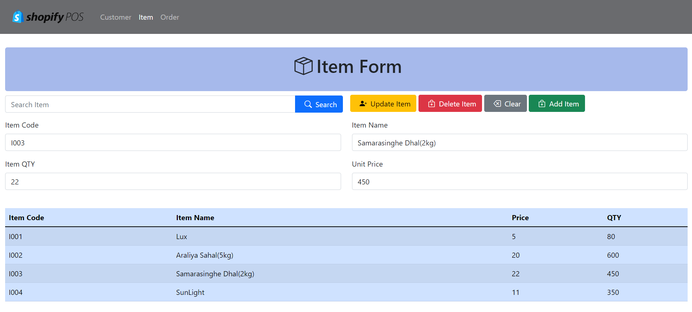

# JavaEE - POS

### What is this ?

A web application is designed for a supermarket to handle its customers, item details and it allows the seller to add order details to the database.

### Purpose ?

This app is built to enhance the knowledge of APIs.

## Built With
#### Languages

• Java  
• HTML  
• CSS  

#### Frameworks & Libraries

• JavaEE  
• Bootstrap  
• Hibernate  
• jQuery  
• MySQL Connector  

#### Architectures

• Service-oriented architecture (SOA)  

#### Others

• AJAX  
• DBCP (Database Connection Pooling)  

